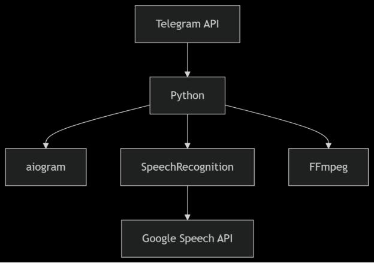
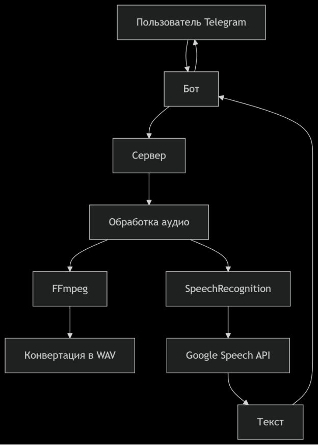
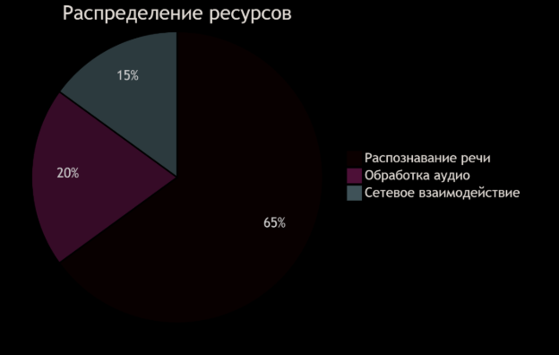

# Техническое руководство по созданию Telegram-бота для конвертации аудио в текст

## 1. Исследование предметной области

### 1.1. Анализ задачи

* Цель: Создать бота, преобразующего голосовые сообщения и аудиофайлы в текст

* Аудитория: Пользователи Telegram, нуждающиеся в расшифровке аудио

#### Аналоги:

* @voicybot

* @SpeechToTextBot

### 1.2. Технологический стек

#### Диаграмма: 

#### Код:

graph TD

A[Telegram API] --> B[Python]

B --> C[aiogram]

B --> D[SpeechRecognition]

B --> E[FFmpeg]

D --> F[Google Speech API]

### 1.3. Архитектура решения

## 2. Пошаговое руководство по созданию бота

### 2.1. Подготовка окружения

#### Установка зависимостей:

pip install aiogram python-dotenv speechrecognition pydub

sudo apt-get install ffmpeg  # Для Linux

#### Создание файла .env:

BOT\_TOKEN=your\_telegram\_bot\_token\_here

### 2.2. Создание базовой структуры бота

from aiogram import Bot, Dispatcher, types

from aiogram.filters import CommandStart

import os

from dotenv import load\_dotenv

load\_dotenv()

bot = Bot(os.getenv('BOT\_TOKEN'))

dp = Dispatcher()

### 2.3. Добавление обработчика старта**

@dp.message(CommandStart())

async def start(message: types.Message):

`    `await message.answer("👋 Привет! Отправь мне аудио, и я преобразую его в текст!")

#### 2.4. Обработка аудиофайлов

@dp.message(F.audio)

async def handle\_audio(message: types.Message):

#### Скачивание файла

file = await bot.get\_file(message.audio.file\_id)

await bot.download\_file(file.file\_path, "temp\_audio.ogg")

#### Конвертация в WAV

os.system('ffmpeg -i temp\_audio.ogg temp\_audio.wav')

#### Распознавание текста

recognizer = sr.Recognizer()

with sr.AudioFile("temp\_audio.wav") as source:

`     `audio\_data = recognizer.record(source)

`     `text = recognizer.recognize\_google(audio\_data, language='ru-RU')

#### Отправка результата

await message.reply(f"🔍 Распознанный текст:\n\n{text}")

### 2.5. Запуск бота

async def main():

`    `await dp.start\_polling(bot)

if \_\_name\_\_ == "\_\_main\_\_":

`    `asyncio.run(main())

## 3. Дополнительные функции

### 3.1. Обработка ошибок

try:

`    `text = recognizer.recognize\_google(audio\_data, language='ru-RU')

except sr.UnknownValueError:

`    `await message.reply("❌ Не удалось распознать речь")

except sr.RequestError:

`    `await message.reply("⚠️ Ошибка сервиса распознавания")

#### 3.2. Поддержка голосовых сообщений

@dp.message(F.voice)

async def handle\_voice(message: types.Message):

`    `# Аналогичная обработка как для аудио

## 4. Развертывание

### 4.1. Локальный запуск

python bot.py

### 4.2. Размещение на сервере**

graph LR

`    `A[Локальная разработка] --> B[Тестирование]

`    `B --> C[Размещение на VPS]

`    `C --> D[Настройка systemd]

`    `D --> E[Мониторинг]

## 5. Оптимизация производительности

#### Диаграмма распределения ресурсов:

Код: 

pie

`    `title Распределение ресурсов

`    `"Распознавание речи" : 65

`    `"Обработка аудио" : 20

`    `"Сетевое взаимодействие" : 15

## 6. Структура репозитория

telegram-audio-bot/

├── bot.py            # Основной код бота

├── requirements.txt  # Зависимости

├── .env              # Конфигурация

├── README.md         # Документация

└── assets/           # Изображения для документации

